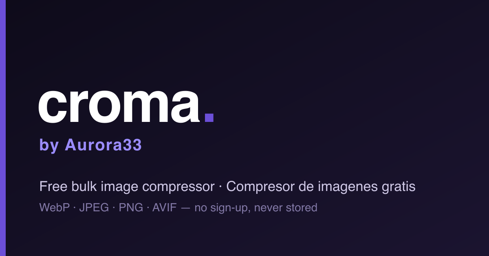

<!-- Language switch -->
[English](./README.md) · **Español**

<p align="center">
  
</p>

<h1 align="center">Croma</h1>

<p align="center">
  Compresor de imágenes gratis y sin registro. Comprime, redimensiona y convierte imágenes en lote — desde tu navegador.
</p>

<p align="center">
  <a href="./LICENSE"></a>
  
  
</p>

---

## ¿Qué es Croma?

Croma es un compresor de imágenes en lote hecho por [Aurora33](https://aurora33.org). Suelta tus imágenes, elige formato y calidad, y descárgalas optimizadas — sin cuenta, sin base de datos, sin almacenar nada. Los archivos subidos se procesan temporalmente y se eliminan automáticamente después de una hora.

## Características

- 📦 **Procesamiento en lote** — comprime muchas imágenes a la vez
- 🔄 **Conversión de formato** — WebP, JPEG, PNG, AVIF
- 🎚️ **Control de calidad** — nivel de compresión ajustable
- 📐 **Redimensionado** — ancho/alto opcional manteniendo proporción
- 🖱️ **Arrastrar y soltar**
- 🌍 **Bilingüe** — español e inglés (`/es`, `/en`)
- 🔒 **Sin registro, sin base de datos** — tus imágenes nunca se almacenan
- ⚡ **Impulsado por [Sharp](https://sharp.pixelplumbing.com/)** (nativo, rápido)

## Inicio rápido (local)

Requiere **Node.js ≥ 20.9** (ver `.nvmrc`). Sin base de datos, sin configuración obligatoria — simplemente corre.

```bash
git clone https://github.com/aurora33labs/tool-croma-oss.git
cd tool-croma-oss
npm install
npm run dev
```

Abre **http://localhost:3000** — y listo. ✨

### Build de producción

```bash
npm run build
npm start
```

## Desplegar en Railway (1 clic)

Levanta tu propia instancia personal en segundos:

[](https://railway.com/deploy/cromaaurora33live)

Sin base de datos ni variables obligatorias — Railway detecta Next.js automáticamente (vía `railway.json` → Railpack) y lo sirve con health check en `/api/health`.

## Configuración opcional

Todo funciona sin tocar nada. Para ajustar límites, define estas variables (todas opcionales):

| Variable | Default | Descripción |
|---|---|---|
| `NEXT_PUBLIC_MAX_FILES` | `100` | Máx. imágenes por lote — **build‑time** |
| `NEXT_PUBLIC_MAX_FILE_MB` | `100` | Tamaño máx. por imagen, en MB — **build‑time** |
| `CLEANUP_INTERVAL` | `15` | Intervalo de limpieza (minutos) |
| `FILE_TTL` | `3600` | Vida del archivo antes de borrarse (segundos) |

> Las `NEXT_PUBLIC_*` se incrustan en build — defínelas **antes** de compilar para que apliquen.

## Stack técnico

Next.js 16 (App Router) · React 19 · Sharp · TailwindCSS · i18n propio ligero.

## Nota para self‑hosting

Las páginas de **Términos** y **Privacidad** incluidas están escritas para Aurora33, así que están **ocultas por defecto** (`/terms` y `/privacy` dan 404 y los enlaces del footer no aparecen). Pon `NEXT_PUBLIC_LEGAL=on` solo si realmente operas bajo esos documentos. Tú eres responsable de tu propio cumplimiento legal.

## Licencia

Croma es **gratis para uso personal y no comercial**. Puedes usarlo, modificarlo y compartirlo — pero **no puedes usarlo comercialmente ni venderlo**. Debe mantenerse gratis. Ver [`LICENSE`](./LICENSE) (PolyForm Noncommercial 1.0.0).

---

<p align="center">
  Hecho por <a href="https://aurora33.org">Aurora33</a> · <a href="https://aurora33.org/contacto">¿Necesitas una solución a medida? Hablemos</a>
</p>
